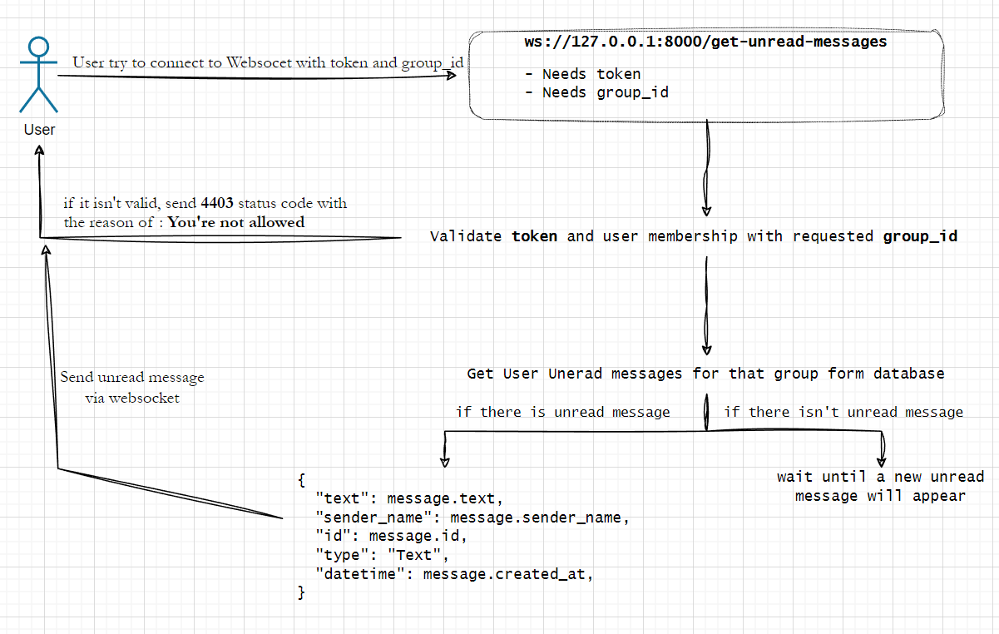
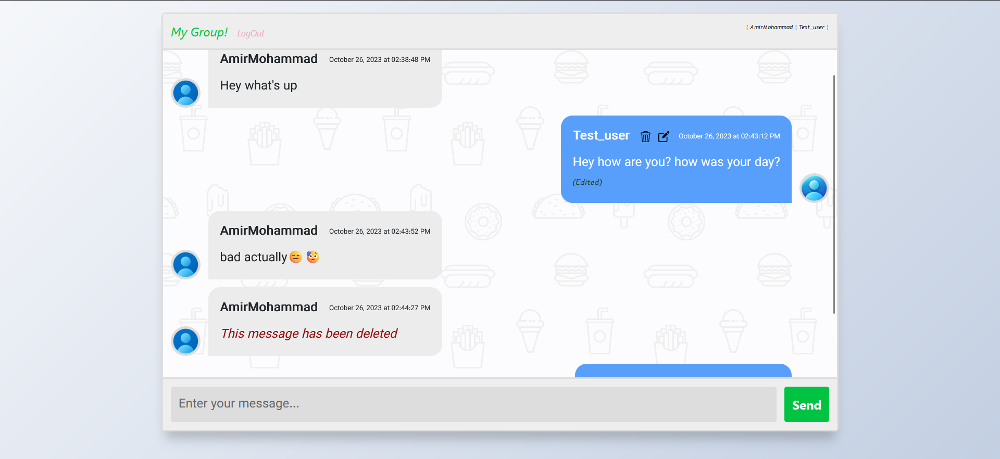
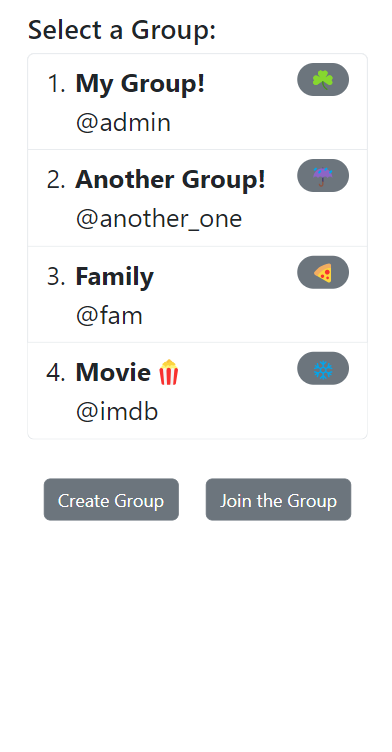
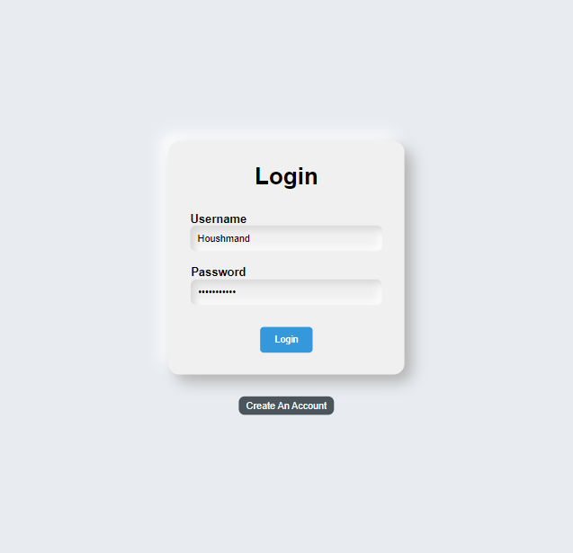
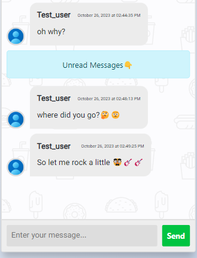
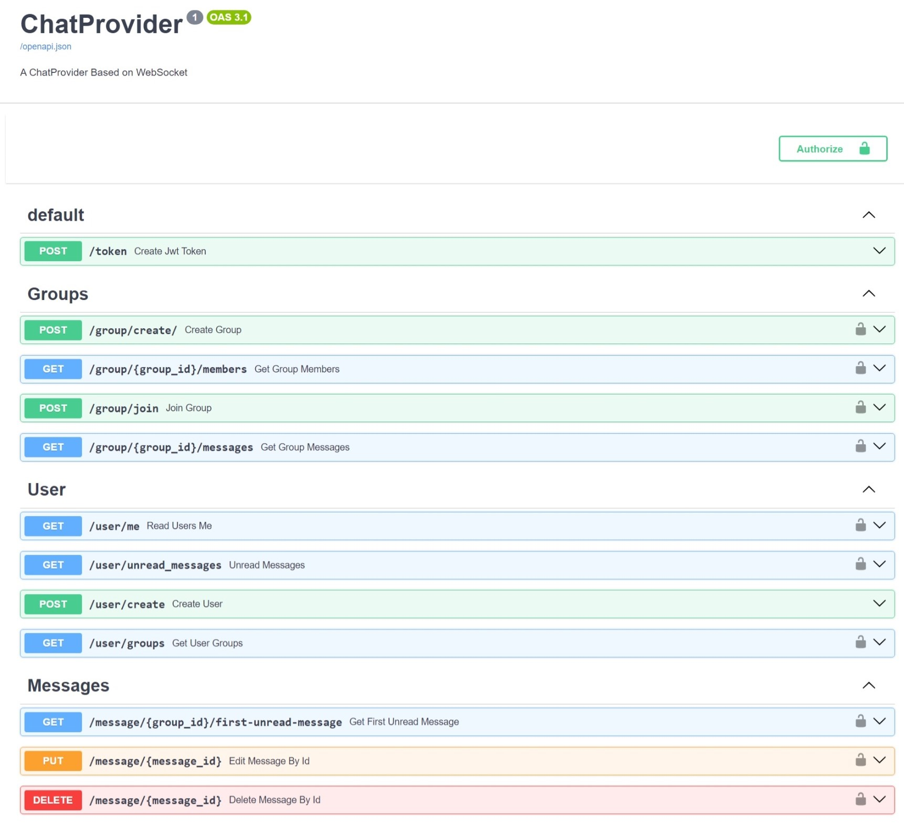

<h1 align="center"/>Chat App</h1>

<p align="center">A WebSocket-based chat application built with <a href="https://github.com/tiangolo/fastapi">FastAPI</a>
</p>

## Table of Contents

- [Overview](#overview)
  - [How It Works](#how-it-works)
    - [Features](#features)
- [How to run it?](#how-to-run)
- [Samples](#samples)
- [ToDo](#todo)

# Overview

This project is a WebSocket chat application created using FastAPI. It allows users to chat with others [**asynchronously**](https://stackoverflow.com/questions/748175/asynchronous-vs-synchronous-execution-what-is-the-difference) in **real-time**, **join groups**, **send** and **receive messages**, and more.<br>

FrontEnd Connect to websocket and api with raw JavaScript and for styling uses bootstrap and css

## How It Works

By sending information with WebSockets, user can receive unread and new messages and send messages and also receive text changes such as edit and delete.

<div align="center">

</div>

Also broadcast 'changes' and 'Send Message' are similar to this

you can see how change broadcast work<sub> (Codes have been shortened for display. See here for full codes: <a href="backend/chat/views/websocket.py">websocket.py</a>)<sub>

```python
async def broadcast_changes(
    group_id: int,
    message_id: int,
    new_text: str | None = None,
    change_type: models.ChangeType,
    db: Session,
) -> None:
  ...
  online_users = set(websocket_connections.keys())
  await asyncio.gather(
      *[
          send_change_to_user(
              member.user.id, changed_value, online_users=online_users
          )
          for member in group.members
      ]
  )

async def send_change_to_user(
    user_id: int, change_data: dict, online_users: set
) -> None:
  ...
  await connection.send_text(json.dumps(change_data))

```

### Features

- **Real-time WebSocket** chat
- Written as **async**
- User **authentication** and **authorization**
- Group **creation** and **management**
- **Sending** and **receiving** messages
- **Editing** and **deleting** messages

# How to run?

we need to get three docker images

- 1.**Python** to run BackEnd and [Uvicorn](https://www.uvicorn.org/)
- 2.**Nginx** to run FrontEnd
- 3.**Postgres** to run DataBase

```bash
# clone the project
git clone https://github.com/houshmand-2005/chat_app
# go to the folder
cd chat_app
# run project with docker
docker-compose up -d
```

# Samples









<hr>
This is list of available APIs:<br>


# ToDo

These are the things I want to do

- Add validation (like email validation username validation and ...)
- Make schemas with [Pydantic](https://pydantic.dev/) for each model(now it is a little incomplete and some models don't have it)
- Make FrontEnd more beautiful and make it more clear (This will probably be hard. I'm not very good at css and html😁)
- Support sending photos and files
- Support replay on message
- Add a cache service for handel unread messages and more (Like **redis**)
